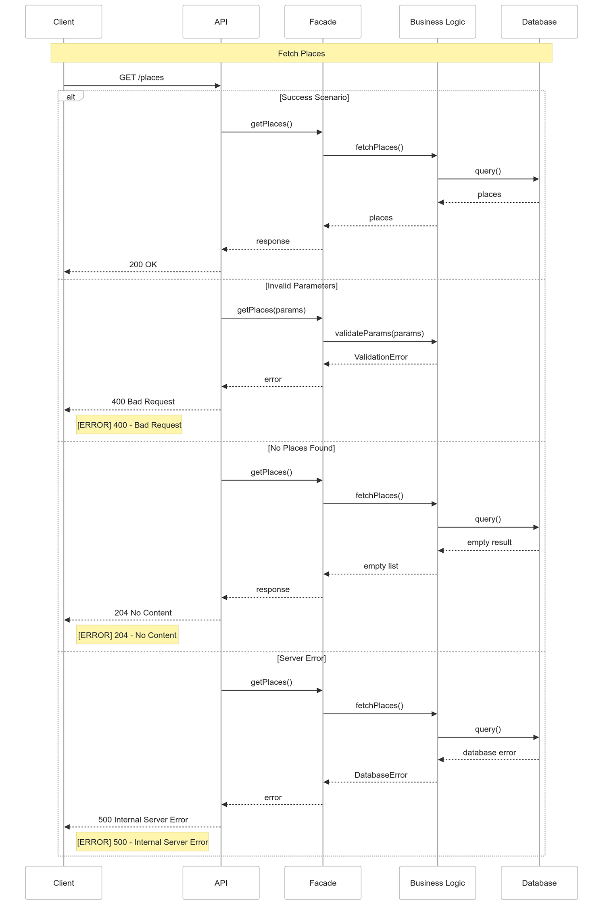

# HBnB Technical Documentation - API Sequence Diagrams

## 1. System Architecture Diagrams

### 1.1 Package Diagram


*Illustrates the 3-tier architecture:
Presentation (API/Web) → Business (Services/Models) → Persistence (Database/Storage).
Shows module dependencies and data flow direction.*

### 1.2 Layer Interactions

**1. Presentation Layer (API/Web)**
- Request/Response Handling:
  - Input validation and sanitization
  - Parameter processing
  - Response formatting
  - Error handling
- Authentication:
  - Token verification
  - Authorization checks
  - Session management
- Data Flow:
  - Request parsing
  - Response serialization
  - API endpoint routing

**2. Business Layer (Services)**
- Business Logic:
  - Data validation rules
  - Business rules enforcement
  - Service orchestration
- Data Processing:
  - Object transformation
  - State management
  - Data aggregation
- Security:
  - Permission verification
  - Business-level validation
  - Transaction coordination

**3. Persistence Layer (Storage)**
- Data Operations:
  - CRUD operations
  - Query optimization
  - Cache management
- Data Integrity:
  - Transaction handling
  - Relationship management
  - Constraint enforcement
- Performance:
  - Query optimization
  - Connection pooling
  - Cache strategies

### 1.3 Class Diagram


*Defines core models (User, Place, Review) with their attributes and relationships. 
BaseModel provides common fields (id, timestamps) to all entities.*

## 2. Sequence Diagrams Analysis

### 2.1 User Registration


*Figure 1: Sequence diagram showing the user registration flow.*

The diagram shows:
- Registration process
- Data validation
- Email uniqueness check
- Error handling scenarios

### 2.2 Place Creation


*Figure 2: Sequence diagram showing the flow of POST /places request.*

Key interactions shown:
- Validation flow
- Success creation path
- Duplicate handling
- Error scenarios

### 2.3 Review Operations


*Figure 3: Sequence diagram showing the flow of POST /reviews request.*

The diagram details:
- Review submission process
- Validation steps
- Success and error paths
- Database interactions

### 2.4 Places List Retrieval



*Figure 4: Sequence diagram showing the flow of GET /places request.*

The diagram illustrates:
- Success scenario (200 OK)
- Error handling for invalid parameters (400)
- No content scenario (204)
- Server error handling (500)

## 3. Implementation Notes

### 3.1 Error Handling
- Layer-specific error types
- Error propagation path
- Standard error responses

### 3.2 Performance
- Caching strategy
- Query optimization
- Response time goals

## 4. Additional Technical Details

### 4.1 Sequence Diagram Analysis
1. Request Flow
   - Initial validation
   - Authentication check
   - Input processing
   - Parameter validation

2. Response Flow
   - Data formatting
   - Status code selection
   - Error response structure
   - Cache headers

3. Data Processing
   - Business rule validation
   - Data transformation
   - State management
   - Transaction control

### 4.2 Cross-Layer Communication
1. Data Flow
   - Request/Response format
   - Error propagation
   - Cache strategy
   - Performance monitoring

2. Security
   - Authentication flow
   - Authorization checks
   - Input validation
   - Rate limiting

### 4.3 Basic Error Handling

#### Common Status Codes
1. Success (200)
   ```
   {
     "message": "Request successful"
   }
   ```

2. Created (201)
   ```
   {
     "message": "Resource created successfully"
   }
   ```

3. No Content (204)
   ```
   {
     "message": "No content"
   }
   ```

4. Validation Errors (400)
   ```
   {
     "error": "VALIDATION_ERROR",
     "message": "Invalid input"
   }
   ```

5. Auth Errors (401/403)
   ```
   {
     "error": "AUTH_ERROR",
     "message": "Unauthorized access"
   }
   ```

6. Not Found (404)
   ```
   {
     "error": "NOT_FOUND",
     "message": "Resource not found"
   }
   ```

7. Conflict (409)
   ```
   {
     "error": "CONFLICT",
     "message": "Resource conflict"
   }
   ```

8. Server Errors (500)
   ```
   {
     "error": "SERVER_ERROR",
     "message": "Internal error"
   }
   ```

#### Error Recovery
- Database rollback on failure
- Basic retry for network issues
- Error logging with timestamps
